# ripper 

A Quarto extension that automatically extracts code blocks from your documents and splits them by programming language into separate, executable script files.

## Installation

To install the `ripper` Quarto extension, follow these steps:

1. Open your terminal.
2. Execute the following command:

```sh
quarto add coatless-quarto/ripper
```

This command will download and install the Quarto extension under the `_extensions` subdirectory of your Quarto project. If you are using version control, ensure that you include this directory in your repository.

## Usage

Add the `ripper` filter to your document's YAML front matter:

````md
---
title: "My Analysis"
filters:
  - ripper
---

```{r}
data <- mtcars
summary(data)
```

```{python}
import pandas as pd
df = pd.DataFrame({"x": [1, 2, 3]})
```
````

Render your document with Quarto:

```bash
quarto render my-analysis.qmd
```

Extracted scripts will be created in the same directory with names based on your document file name, e.g.

- `my-analysis.R` - All R code extracted
- `my-analysis.py` - All Python code extracted

Links to the generated script files will be included in your rendered
document under a "Script file(s)" section or at a custom location
if specified.

## Configuration

Ripper supports multiple global options under `extensions.ripper`:

```yaml
---
echo: true                           # Required to include code blocks in output
filters:
  - ripper
extensions:
  ripper:
    include-yaml: true               # Include YAML as comments (default: true)
    script-links-position: "bottom"  # Position of links section (default: "bottom")
    output-name: "my-scripts"        # Custom base name for output files (optional)
    debug: false                     # Enable verbose logging (default: false)
---
```

#### Option: `include-yaml`

- **`true` (default)**: Includes YAML frontmatter as commented lines at the top of each script
- **`false`**: Extracts only code with no YAML comments

#### Option: `script-links-position`

Controls where the "Script file(s)" section with links to generated scripts appears:

- **`"bottom"` (default)**: Places the section at the end of the document
- **`"top"`**: Places the section at the beginning of the document
- **`"custom"`**: Places the section where you define a Div with `#ripper-links` in your document
- **`"none"`**: Suppresses the section entirely

##### Custom Positioning Example

- To place the section at a specific location in your document, use `script-links-position: "custom"` and add a Div with the id `#ripper-links`.

````md
---
title: "My Analysis"
filters:
  - ripper
extensions:
  ripper:
    script-links-position: "custom"
---

## Introduction

Some introductory text here.

::: {#ripper-links}
:::

## Analysis

```{r}
# Your code here
```
````


#### Option: `output-name`

- Allows you to specify a custom base name for the generated script files instead of using the document name.
- For example, if you set `output-name: "my-custom-name"`, rendering `my-analysis.qmd` would produce:
  - `my-custom-name.R`
  - `my-custom-name.py`

#### Option: `debug`

- Enables verbose logging to help troubleshoot issues or understand the extension's behavior.


## Supported Languages

16 languages supported with appropriate file extensions and comment styles:

| Language   | Extension | Comment |
|------------|-----------|---------|
| R          | .R        | #'      |
| Python     | .py       | #'      |
| Julia      | .jl       | #'      |
| Bash       | .sh       | #'      |
| JavaScript | .js       | //'     |
| TypeScript | .ts       | //'     |
| SQL        | .sql      | --'     |
| Rust       | .rs       | //'     |
| Go         | .go       | //'     |
| C++        | .cpp      | //'     |
| C          | .c        | //'     |
| Java       | .java     | //'     |
| Scala      | .scala    | //'     |
| Ruby       | .rb       | #'      |
| Perl       | .pl       | #'      |
| PHP        | .php      | //'     |

## See Also

### Related Quarto Extensions

1. **[sorting-hat](https://github.com/coatless-quarto/sorting-hat)**: Conditionally retain or omit code blocks by language in rendered documents. 
    - Use with ripper to control what appears in your document while extracting all visible code to scripts.
2. **[regurgitate](https://github.com/coatless-quarto/regurgitate)**: Automatically create code appendices in your rendered document, organized by language or document order. 
    - Complements ripper by providing in-document code listings while ripper creates external executable files.

### Historical Context

Ripper's ability to extract code from Quarto documents originated a feature request I submitted in
[`quarto-dev/quarto-cli` issue #1156](https://github.com/quarto-dev/quarto-cli/issues/1156) back on June 14, 2022.
